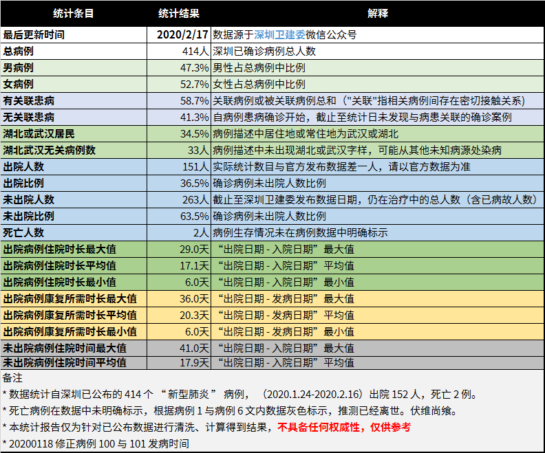

# 深圳“新冠肺炎”病例数据分析

本分析结果所用数据均取自深圳卫建委微信公众号公开发布的数据，任何与官方有出入的数据，均应以官方数据为准。本数据分析的目的是为了更好的利用公开数据，从多个侧面了解疫情的有关信息。 

## 数据分析

### 20200218

数据来源：https://mp.weixin.qq.com/s/Qrxt0fHON11JGqwCEpjNvQ

## 数据分析过程

1.  对官方数据进行数据格式化
2.  利用正则表达式提取相关有用信息 （参考 [regex.md](./regex.md)）
3.  汇总后进行数据统计

## 免责声明

-   本统计报告仅为针对已公布数据进行清洗、计算得到结果，不具备任何权威性，仅供参考。
-   任何组织或个人由于引用本数据造成的任何影响均与本人无关。

